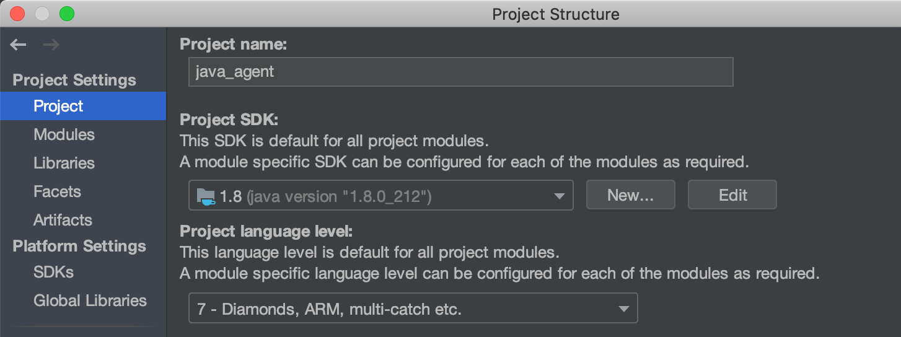

<a href="https://opensource.newrelic.com/oss-category/#community-plus"><picture><source media="(prefers-color-scheme: dark)" srcset="https://github.com/newrelic/opensource-website/raw/main/src/images/categories/dark/Community_Plus.png"><source media="(prefers-color-scheme: light)" srcset="https://github.com/newrelic/opensource-website/raw/main/src/images/categories/Community_Plus.png"></picture></a>

# newrelic-java-agent

With [New Relic's Java agent](https://docs.newrelic.com/docs/agents/java-agent) for bytecode instrumentation, you can track everything from performance issues to tiny errors within your code. Our Java agent monitors your Java app and provides visibility into the behavior of your JVM. After installing, you can quickly monitor transactions, dive deep into errors, and more.

Java agent releases follow [semantic versioning conventions](https://semver.org/). See [Java agent release notes](https://docs.newrelic.com/docs/release-notes/agent-release-notes/java-release-notes) for full details on releases and downloads. Java agent artifacts can also be found on [Maven](https://search.maven.org/search?q=com.newrelic.agent.java).

## Installation

To install the Java agent you need to configure your JVM to load the agent during your application's `premain` start-up by passing the `-javaagent:/full/path/to/newrelic.jar` command-line argument. This process varies depending on your environment/application server.

For full details see:
- [General installation instructions](https://docs.newrelic.com/docs/agents/java-agent/installation/install-java-agent)
- [Application server specific instructions](https://docs.newrelic.com/docs/agents/java-agent/installation/include-java-agent-jvm-argument)
- [Additional installation instructions (Maven, Gradle, etc)](https://docs.newrelic.com/docs/agents/java-agent/additional-installation)

## Getting started

See the [getting started guide](https://docs.newrelic.com/install/java) as well as the [compatibility and requirements documentation](https://docs.newrelic.com/docs/agents/java-agent/getting-started/compatibility-requirements-java-agent) for an overview of what is supported by the Java agent.

## Usage

See the following documentation for specific use cases of the Java agent:
- [General agent configuration](https://docs.newrelic.com/docs/agents/java-agent/configuration)
- [Collecting default/custom Java agent attributes](https://docs.newrelic.com/docs/agents/java-agent/attributes/java-agent-attributes)
- [Adding custom instrumentation to your application](https://docs.newrelic.com/docs/agents/java-agent/custom-instrumentation)
- [Java agent API guides](https://docs.newrelic.com/docs/apm/agents/java-agent/api-guides/guide-using-java-agent-api)
- [Java agent async instrumentation API guides](https://docs.newrelic.com/docs/apm/agents/java-agent/async-instrumentation/introduction-java-async-instrumentation)
- [Troubleshooting](https://docs.newrelic.com/docs/agents/java-agent/troubleshooting)
- [Java agent Javadocs](https://newrelic.github.io/java-agent-api/javadoc/index.html?com/newrelic/api/agent/package-summary.html)

## Building

#### JDK requirements

The Java agent uses a variety of JDK versions when building and running tests. These need to be installed and configured for your environment.

Edit or create the `~/.gradle/gradle.properties` file and add the following JDKs, ensuring that the vendors/versions match what is installed in your environment (Mac OS X examples shown).

JDK 8 is required to build the agent:

```
jdk8=/Library/Java/JavaVirtualMachines/adoptopenjdk-8.jdk/Contents/Home
```

Additionally, the `-PtestN` Gradle property can be used to run tests on a specific JDK version which may require further JDK configuration.
To keep test times reasonable the project only allows testing against supported LTS Java releases as well as the latest non-LTS release of Java.
For example to run tests with Java 17, the `-Ptest17` Gradle property would cause the test to use `jdk17` as configured below:

```
jdk17=/Library/Java/JavaVirtualMachines/temurin-17.jdk/Contents/Home
```

#### Gradle build

The Java agent requires JDK 8 to build; your `JAVA_HOME` must be set to this JDK version.

To build the agent jar, run the following command from the project root directory:  
`./gradlew clean jar --parallel`

To build and run all checks:  
`./gradlew clean build --parallel`

After building, Java agent artifacts are located here:  
- Agent: `newrelic-agent/build/newrelicJar/newrelic.jar`
- Agent API: `newrelic-api/build/libs/newrelic-api-*.jar`

#### Non standard modules

The following modules have specific requirements to be built. The instructions for each is in the module's README.md.

- [aws-wrap-0.7.0](./instrumentation/aws-wrap-0.7.0/README.md)
- [jboss-7](./instrumentation/jboss-7/README.md)
- [jdbc-inet-merlia](./instrumentation/jdbc-inet-merlia/README.md)
- [jdbc-inet-oranxo](./instrumentation/jdbc-inet-oranxo/README.md)
- [jdbc-ojdbc](./instrumentation/jdbc-ojdbc/README.md)
- [jdbc-sybase-6](./instrumentation/jdbc-sybase-6/README.md)
- [open-liberty-jakarta-21.0.0.12](./instrumentation/open-liberty-jakarta-21.0.0.12/README.md)
- [resin-3](./instrumentation/resin-3/README.md)
- [weblogic-12.2](./instrumentation/weblogic-12.2/README.md)
- [weblogic-12](./instrumentation/weblogic-12/README.md)
- [weblogic-jmx-12.2.1](./instrumentation/weblogic-jmx-12.2.1/README.md)
- [weblogic-jmx-12](./instrumentation/weblogic-jmx-12/README.md)
- [websphere-8](./instrumentation/websphere-8/README.md)
- [websphere-jmx-7](./instrumentation/websphere-jmx-7/README.md)
- [websphere-liberty-profile-8.5.5.5](./instrumentation/websphere-liberty-profile-8.5.5.5/README.md)
- [websphere-liberty-profile-dispatcher-8.5.5.5](./instrumentation/websphere-liberty-profile-dispatcher-8.5.5.5/README.md)
- [websphere-liberty-profile-environment-8.5.5.5](./instrumentation/websphere-liberty-profile-environment-8.5.5.5/README.md)

## IntelliJ IDEA setup

We recommend using IntelliJ IDEA for development on this project. Configure as follows:

1. Select `File > Open` and select `newrelic-java-agent/build.gradle`.
2. Select `Open as Project`.
3. Wait for the builds, imports, and indexing to finish. This may take a few minutes due to the project's size and complexity.
4. Import Code Style: from `dev-tools/code-style/java-agent-code-style.xml`, select `Preferences > Editor > Code Style > gear cog > Import Scheme > IntelliJ IDEA code style XML`.
5. Add Java 8 SDK: select `File > Project Structure... > Platform Settings > SDKs > Add New SDK`.
6. Configure project SDK and target language level: select `File > Project Structure... > Project Settings > Project`.
    - Set `Project SDK` to JDK 1.8
    - Set `Project language level` to 8

7. Increase Intellij memory heap if you encounter "Low Memory" issues. Recommended: 2048 MB. To do this, select `Help > Change Memory Settings > Save and Restart`.

## Testing

The Java agent utilizes the following four distinct test suites, each of which is supported by a test framework. Each has specific strengths and weaknesses and each serves a particular purpose.

#### Conventional unit tests

The unit tests are conventional JUnit tests. The supporting framework is the industry-standard JUnit dependency. Unit tests rely on a variety of different mock object frameworks combined with complex test initialization patterns that simulate agent initialization. Scala test tasks are excluded by default. Including the -PincludeScala project property includes Scala test tasks.

Run all unit tests:

```
./gradlew -PnoInstrumentation clean test --continue --parallel
```

Run an individual unit test:

```
./gradlew -PnoInstrumentation clean newrelic-weaver:test --tests "com.newrelic.weave.LineNumberWeaveTest.testRemoveWeaveLineNumbers" --parallel
```

Run an individual unit test on a specific version of Java:

```
./gradlew -Ptest17 -PnoInstrumentation clean newrelic-weaver:test --tests "com.newrelic.weave.LineNumberWeaveTest.testRemoveWeaveLineNumbers" --parallel
```

#### Functional tests

The functional tests are JUnit tests for which Gradle ensures that each test class runs in a separate subprocess that initializes the agent. The test framework is a combination of industry-standard JUnit, Gradle, a small Gradle test executor task, and some special classes that address limitations of the base framework.

**Note:** Functional tests require that the Java agent jar artifact is present in the build directory. 

Functional tests are located in `newrelic-java-agent/functional_test/src/test/` and are run from the root `newrelic-java-agent` directory as follows:

Run all functional tests: 
```
./gradlew functional_test:test --continue --parallel
```

Run an individual functional test: 
```
./gradlew functional_test:test --tests test.newrelic.test.agent.AgentTest --parallel
```

#### Instrumentation module tests

The instrumentation module tests are also JUnit tests. The framework is the industry-standard JUnit dependency modified by a custom test runner and class loader that support bytecode weaving within the test without the need to fully initialize the agent. Note: fully initializing the agent is not possible when running in an uninstrumented reusable test process like an IntelliJ test subprocess or Gradle daemon. There is also an "introspector" (somewhat equivalent to a local mock collector) for test assertions.

Some of the instrumentation tests use [Testcontainers](https://www.testcontainers.org/) so you might need to have Docker [installed](https://docs.docker.com/get-docker/) to run them locally.

Instrumentation tests are located in each instrumentation module at  `newrelic-java-agent/instrumentation/<INSTRUMENTATION MODULE>/src/test` and are run from the root `newrelic-java-agent` directory as follows:

Run all instrumentation module tests: 
```
./gradlew instrumentation:test --continue --parallel
```

Run all tests for a specific instrumentation module: 
```
./gradlew instrumentation:akka-http-core-10.0.11:test --parallel
```

Run a single test for a specific instrumentation module:
```
./gradlew instrumentation:vertx-web-3.2.0:test --tests com.nr.vertx.instrumentation.RoutingTest --parallel
```

Run all tests for a specific Scala instrumentation module:
```
./gradlew -PincludeScala instrumentation:sttp-2.13_2.2.3:test --parallel
```

## Code Quality

The agent utilizes [Jacoco](https://www.jacoco.org/jacoco/) and [Spotbugs](https://spotbugs.readthedocs.io/en/stable/introduction.html) to measure and improve code quality. We also use [Codecov](https://docs.codecov.com/docs/quick-start) to report
code coverage. Jacoco and Spotbug tools are configured through the gradle build system. Codecov is configured and uploaded through a GitHub Actions workflow.

#### Jacoco

The `jacocoTestReport` task depends on the unit `test` task. It uses data generated by the test task to create the coverage reports. `jacocoTestReport` task creates an html and xml file of the output.  We store these files locally in the respective module's `build/reports/jacoco` folder.  The html file can be opened normally in a browser. 
Some subprojects have not been configured to run because the code is either too trivial to test or it is code that is only compile time dependency and not necessary to test due to the nature
of how the agent instruments customer code.

To run jacoco, execute unit tests in the usual ways given under the section [Convential unit tests](#Conventional-unit-tests).  The `jacocoTestReport` task will run automatically after the unit tests complete.

#### Codecov

We use a codecov github action to upload the jacoco coverage reports to [codecov.io](https://app.codecov.io/gh/newrelic/newrelic-java-agent). Additionally, codecov will comment on pull requests (PRs) with a quick overview of how PRs (and relevant commits) will affect the code coverage as compared to the `main` branch.


#### Spotbugs

[Spotbugs](https://spotbugs.readthedocs.io/en/stable/introduction.html) is a static code analysis tool to identify bugs in Java programs. It utilizes the Spotbugs
gradle plugin. The projects that are scanned by Spotbugs are:
- newrelic-agent
- newrelic-weaver
- agent-bridge
- agent-model
- newrelic-api

To run Spotbugs, execute the following command:
```text
./gradlew spotbugsMain --parallel
```

The task will generate both XML and HTML files in the `build/spotbugs` folder underneath each subproject's top level folder.
The HTML file can be opened normally in a browser. The XML files can be imported into the [Spotbugs UI](https://spotbugs.readthedocs.io/en/stable/gui.html).

## Support

Should you need assistance with New Relic products, you are in good hands with several diagnostic tools and support channels.

This [troubleshooting framework](https://discuss.newrelic.com/t/java-agent-troubleshooting-framework-install/108680) steps you through common troubleshooting questions.

New Relic offers NRDiag, [a client-side diagnostic utility](https://docs.newrelic.com/docs/using-new-relic/cross-product-functions/troubleshooting/new-relic-diagnostics) that automatically detects common problems with New Relic agents. If NRDiag detects a problem, it suggests troubleshooting steps. NRDiag can also automatically attach troubleshooting data to a New Relic Support ticket.

If the issue has been confirmed as a bug or is a Feature request, please file a Github issue.

**Support Channels**

* [New Relic Documentation](https://docs.newrelic.com/docs/agents/java-agent): Comprehensive guidance for using our platform
* [New Relic Community](https://forum.newrelic.com/s/): The best place to engage in troubleshooting questions
* [New Relic Developer](https://developer.newrelic.com/): Resources for building a custom observability applications
* [New Relic University](https://learn.newrelic.com/): A range of online training for New Relic users of every level
* [New Relic Technical Support](https://support.newrelic.com/) 24/7/365 ticketed support. Read more about our [Technical Support Offerings](https://docs.newrelic.com/docs/licenses/license-information/general-usage-licenses/support-plan). 

## Privacy
At New Relic we take your privacy and the security of your information seriously, and are committed to protecting your information. We must emphasize the importance of not sharing personal data in public forums, and ask all users to scrub logs and diagnostic information for sensitive information, whether personal, proprietary, or otherwise.

We define “Personal Data” as any information relating to an identified or identifiable individual, including, for example, your name, phone number, post code or zip code, Device ID, IP address and email address.

Please review [New Relic’s General Data Privacy Notice](https://newrelic.com/termsandconditions/privacy) for more information.

## Contribute
We encourage your contributions to improve `newrelic-java-agent`. Keep in mind when you submit your pull request, you'll need to sign the CLA via the click-through using CLA-Assistant. You only have to sign the CLA one time per project.

If you have any questions, or to execute our corporate CLA, required if your contribution is on behalf of a company, please drop us an email at opensource@newrelic.com.

**A note about vulnerabilities**

As noted in our [security policy](https://github.com/newrelic/newrelic-java-agent/security/policy), New Relic is committed to the privacy and security of our customers and their data. We believe that providing coordinated disclosure by security researchers and engaging with the security community are important means to achieve our security goals.

If you believe you have found a security vulnerability in this project or any of New Relic's products or websites, we welcome and greatly appreciate you reporting it to New Relic through [our bug bounty program](https://docs.newrelic.com/docs/security/security-privacy/information-security/report-security-vulnerabilities/).

## License
`newrelic-java-agent` is licensed under the [Apache 2.0](https://apache.org/licenses/LICENSE-2.0.txt) License.

The `newrelic-java-agent` also uses source code from third-party libraries. You can find full details on which libraries are used and the terms under which they are licensed in the third-party notices document and our [Java agent licenses public documentation](https://docs.newrelic.com/docs/licenses/product-or-service-licenses/new-relic-apm/java-agent-licenses).
