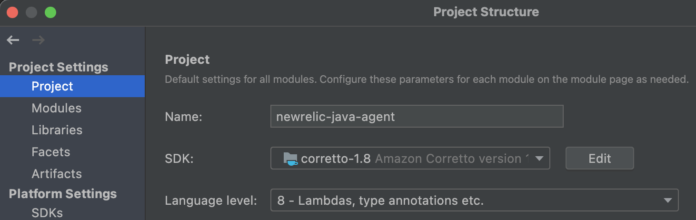

[](https://opensource.newrelic.com/oss-category/#community-project)

# newrelic-java-agent

With [New Relic's Java agent](https://docs.newrelic.com/docs/agents/java-agent) for bytecode instrumentation, you can track everything from performance issues to tiny errors within your code. Our Java agent monitors your Java app and provides visibility into the behavior of your JVM. After installing, you can quickly monitor transactions, dive deep into errors, and more.

Java agent releases follow [semantic versioning conventions](https://semver.org/). See [Java agent release notes](https://docs.newrelic.com/docs/release-notes/agent-release-notes/java-release-notes) for full details on releases and downloads. Java agent artifacts can also be found on [Maven](https://search.maven.org/search?q=com.newrelic.agent.java).

## Installation

To install the Java agent you need to configure your JVM to load the agent during your application's `premain` start-up by passing the `-javaagent:/full/path/to/newrelic.jar` command-line argument. This process varies depending on your environment/application server.

For full details see:
- [General installation instructions](https://docs.newrelic.com/docs/agents/java-agent/installation/install-java-agent)
- [Application server specific instructions](https://docs.newrelic.com/docs/agents/java-agent/installation/include-java-agent-jvm-argument)
- [Additional installation instructions (Maven, Gradle, etc)](https://docs.newrelic.com/docs/agents/java-agent/additional-installation)

## Getting started

See the [getting started guide](https://docs.newrelic.com/docs/agents/java-agent/getting-started) as well as the [compatibility and requirements documentation](https://docs.newrelic.com/docs/agents/java-agent/getting-started/compatibility-requirements-java-agent) for an overview of what is supported by the Java agent.

## Usage

See the following documentation for specific use cases of the Java agent:
- [General agent configuration](https://docs.newrelic.com/docs/agents/java-agent/configuration)
- [Collecting default/custom Java agent attributes](https://docs.newrelic.com/docs/agents/java-agent/attributes/java-agent-attributes)
- [Adding custom instrumentation to your application](https://docs.newrelic.com/docs/agents/java-agent/custom-instrumentation)
- [Java agent API guides](https://docs.newrelic.com/docs/agents/java-agent/api-guides)
- [Java agent async instrumentation API guides](https://docs.newrelic.com/docs/agents/java-agent/async-instrumentation)
- [Troubleshooting](https://docs.newrelic.com/docs/agents/java-agent/troubleshooting)

## Building

#### JDK requirements

The Java agent uses a variety of JDK versions when building and running tests. These need to be installed and configured for your environment.

Edit or create the `~/.gradle/gradle.properties` file and add the following JDKs, ensuring that the vendors/versions match what is installed in your environment (Mac OS X examples shown).

JDK 7 and JDK 8 are required to build the agent:

```
jdk7=/Library/Java/JavaVirtualMachines/jdk1.7.0_80.jdk/Contents/Home
jdk8=/Library/Java/JavaVirtualMachines/adoptopenjdk-8.jdk/Contents/Home
```

Additionally, the `-PtestN` Gradle property can be used to run tests on a specific JDK version which may require further JDK configuration. For example to run tests with Java 9, the `-Ptest9` Gradle property would cause the test to use `jdk9` as configured below:

```
jdk9=/Library/Java/JavaVirtualMachines/adoptopenjdk-9.jdk/Contents/Home
```

#### Gradle build

The Java agent requires JDK 1.8 to build; your `JAVA_HOME` must be set to this JDK version.

To build the agent jar, run the following command from `java_agent` root directory:  
`./gradlew clean jar --parallel`

To build and run all checks:  
`./gradlew clean build --parallel`

After building, Java agent artifacts are located here:  
- Agent: `java_agent/newrelic-agent/build/newrelicJar/newrelic.jar`
- Agent API: `java_agent/newrelic-api/build/libs/newrelic-api.jar`

#### Agent version

The Java agent version defaults to `6.DEV-SNAPSHOT` for developer builds. You can change this in the `gradle.properties` file. To avoid confusion, we recommend against using version numbers for developer builds that look like production releases.

## IntelliJ IDEA setup

We recommend using IntelliJ IDEA for development on this project. Configure as follows:

1. Select `File > Open` and select `java_agent/build.gradle`.
2. Select `Open as Project`.
3. Wait for the builds, imports, and indexing to finish. This may take a few minutes due to the project's size and complexity.
4. Import Code Style: from `dev-tools/code-style/java-agent-code-style.xml`, select `Preferences > Editor > Code Style > gear cog > Import Scheme > IntelliJ IDEA code style XML`.
5. Add Java 8 SDK: select `File > Project Structure... > Platform Settings > SDKs > Add New SDK`.
6. Configure project SDK and target language level: select `File > Project Structure... > Project Settings > Project`.
    - Set `Project SDK` to JDK 1.8
    - Set `Project language level` to 7  

7. Increase Intellij memory heap if you encounter "Low Memory" issues. Recommended: 2048 MB. To do this, select `Help > Change Memory Settings > Save and Restart`.

## Testing

The Java agent utilizes the following four distinct test suites, each of which is supported by a test framework. Each has specific strengths and weaknesses and each serves a particular purpose.

#### Conventional unit tests

The unit tests are conventional JUnit tests. The supporting framework is the industry-standard JUnit dependency. Unit tests rely on a variety of different mock object frameworks combined with complex test initialization patterns that simulate agent initialization.

#### Functional tests

The functional tests are JUnit tests for which Gradle ensures that each test class runs in a separate subprocess that initializes the agent. The test framework is a combination of industry-standard JUnit, Gradle, a small Gradle test executor task, and some special classes that address limitations of the base framework.

**Note:** Functional tests require that the Java agent jar artifact is present in the build directory. 

Functional tests are located in `java_agent/functional_test/src/test/` and are run from the root `java_agent` directory as follows:

Run all functional tests: 
```
./gradlew functional_test:test --parallel
```

Run an individual functional test: 
```
./gradlew functional_test:test --parallel --tests test.newrelic.test.agent.AgentTest
```

#### Instrumentation module tests

The instrumentation module tests are also JUnit tests. The framework is the industry-standard JUnit dependency modified by a custom test runner and class loader that support bytecode weaving within the test without the need to fully initialize the agent. Note: fully initializing the agent is not possible when running in an uninstrumented reusable test process like an IntelliJ test subprocess or Gradle daemon. There is also an "introspector" (somewhat equivalent to a local mock collector) for test assertions.

Instrumentation tests are located in each instrumentation module at  `java_agent/instrumentation/<INSTRUMENTATION MODULE>/src/test` and are run from the root `java_agent` directory as follows:

Run all instrumentation module tests: 
```
./gradlew instrumentation:test --parallel
```

Run all tests for a specific instrumentation module: 
```
./gradlew instrumentation:akka-http-core-10.0.11:test
```

Run a single test for a specific instrumentation module:
```
./gradlew instrumentation:vertx-web-3.2.0:test --tests com.nr.vertx.instrumentation.RoutingTest
```

## Support

New Relic hosts and moderates an online forum where customers can interact with New Relic employees as well as other customers to get help and share best practices. Like all official New Relic open source projects, there's a related Community topic in the New Relic Explorers Hub. You can find this project's topic/threads here:

https://discuss.newrelic.com/c/support-products-agents/java-agent

## Contributing
We encourage your contributions to improve `newrelic-java-agent`. Keep in mind when you submit your pull request, you'll need to sign the CLA via the click-through using CLA-Assistant. You only have to sign the CLA one time per project.
If you have any questions, or to execute our corporate CLA, required if your contribution is on behalf of a company, please drop us an email at opensource@newrelic.com.

## License
`newrelic-java-agent` is licensed under the [Apache 2.0](http://apache.org/licenses/LICENSE-2.0.txt) License.

The `newrelic-java-agent` also uses source code from third-party libraries. You can find full details on which libraries are used and the terms under which they are licensed in the third-party notices document and our [Java agent licenses public documentation](https://docs.newrelic.com/docs/licenses/product-or-service-licenses/new-relic-apm/java-agent-licenses).
