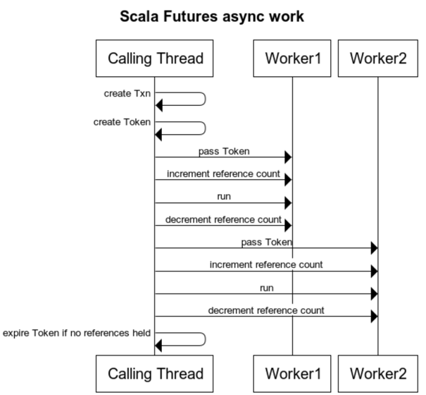
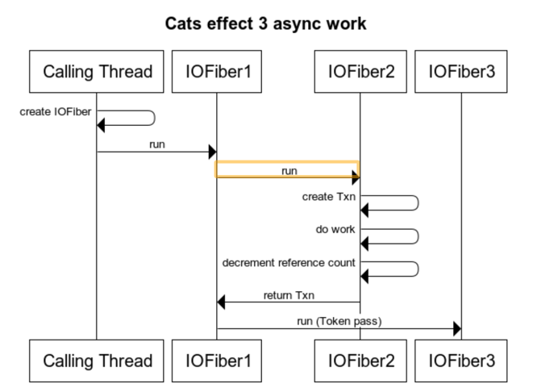

#Cats Effect 3 thread handling

The purpose of this document is to highlight the instrumentation between cats effect 3 and other scala asyncronous 
frameworks 
(Scala Futures, Cats Effect 2, ZIO)

The purpose of instrumentation in each scala asynchronous framework is to ensure that a token is implicitly passed 
to each worker thread so that a running transaction can be access if needed. All frameworks make use of thread pools 
(some abstraction on top of java.util.concurrent.ExecutorService)
to run tasks asyncronously.  

The standard interaction between caller and worker thread can be seen below. A structure 
to hold the token that is shared between threads and a reference count of live threads using the token is stored on 
the caller thread. When the worker thread begins work the reference count is incremented, work is carried out, and 
the reference count decremented. When the reference count become 0 the token is expired. 

Cats effect libraries try to ignore thread local state instead using their own 'logical' thread called Fibers. These 
are similar to Project loom fibers and are objects that can live accross 1 or many threads. Cats effect use Fibers 
instead of Threadlocal to keep all state. Also threads can be reused by many fibers for performance.  
Some differences were found when intrumenting cats effect 3 to cats effect 2. The same library calls to created a 
transaction and segments had different behaviour across threads in CE2 + CE3 . Cats effect 3 ensures all work is done on worker 
threads (see below diagram). This means that a newly created transaction is added to a worker thread and must be passed on to 
other threads. 

2 changes were added to deal with these differences
- Token reference count was tied to IOFibers rather than threads. It was found too difficult to track thread usage 
  across multiple threads. Reference counts are incremented in the Fibers constructor, Fibers also have a 
  `done` method called when a Fiber's lifespan is complete.
  Using token reference count for Fibers made instrumentation more reliable 
- Instrumentation to check if a transaction has been created on a worker thread. If this has happened the token and 
  reference count is copied to the calling thread.  
  