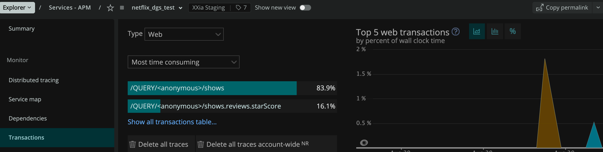
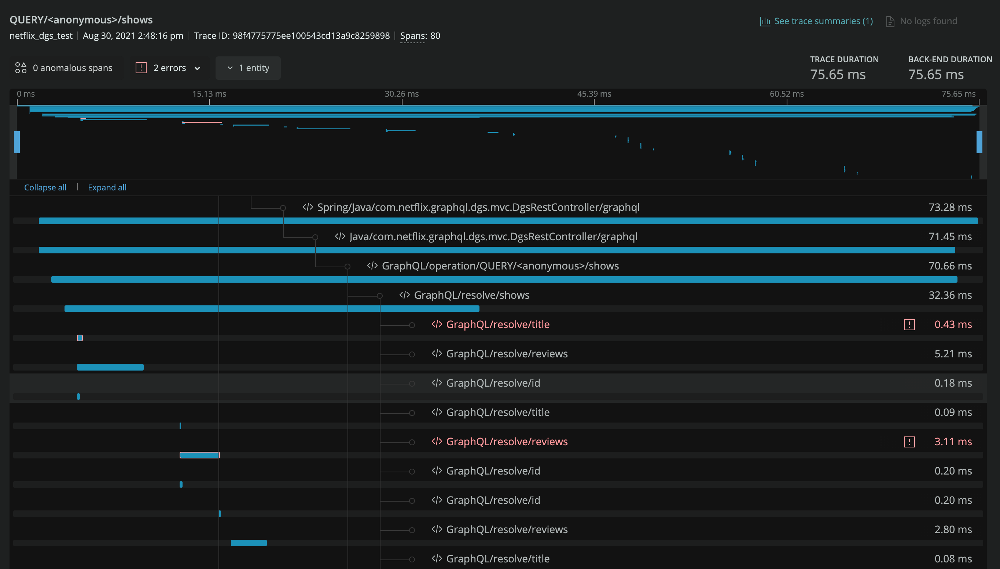

GraphQL Instrumentation
=======================

A graphQL request can be made by any httpclient. 

So the instrumentation work is really focused on the graphql-core library that:

* Parses the query for syntax errors
* Validates the query for validation errors
* Checks to make sure  fields that require a non-null value to be returned, gets  a non-null value.
* Executes the query, resolving each field, which will activate DataFetchers for those fields.

## Transaction name

Change the transaction name from something like

`WebDispatcher/SpringController/web.#graphql….`

To

`/QUERY/<anonymous>/shows`

## Spans

One request can create hundreds of spans. Generate Spans with helpful names and that have certain attributes on those spans

Report errors that occur during a request. There can be many errors.  We try to capture as many as we can.

### GraphQL (start timing)

Our chosen entry for sake of timing staring `GraphQL.executeAsync()`.  All the `GraphQL` public methods eventually go
through this method.  Even the `sync` ones call it and block.

`public CompletableFuture<ExecutionResult> executeAsync(ExecutionInput executionInput)`

### ParseAndValidate Instrumentation

Pretty quickly in executeAsync, we start instrumentation at `ParseAndValidate_Instrumentation`

`parse()`

Allows us to create:

* transaction name
* set span name (e.g. `GraphQL/operation/<transactionName>`)
* set span attributes

The reason instrumentation starts here is that we have access to graphQL objects that allow us to create the proper
transaction name, span Name, and attribute values for spans without writing our own parse code.

`validate()`

If the GraphQL Document does not pass validation, we report the error.
The specification says not to change the transaction name.

### ExecutionStrategy_instrumentation

So if parsing and validation were both error free, the query can be fully resolved.

* starting timing on resolving the fields
* set the span name (e.g. `GraphQL/resolve/<fieldName>`)
* set span attributes

`protected CompletableFuture<FieldValueInfo> resolveFieldWithInfo(ExecutionContext executionContext, ExecutionStrategyParameters parameters)`

## GraphQL Errors

There can be errors during resolve. GraphQL seems to handle two groups of exceptions with two different paths.

1. Parsing and validation errors captured above in `ParseAndValidate_Instrumentation`
2. `completeValue()` is to capture the `graphql.execution.NonNullableFieldWasNullException`
3. `handleException()` is for everything else

## Obfuscator

There are utility classes in the instrumentation module:

The obfuscator is to obfuscate the GraphQL query, according to spec. 
The code is copied from the agent SqlObfuscator, with a slight tweak to a regex.  

## Gotchas

* `TracerToSpanEvent` class in the agent. 
  * `maybeSetGraphQLAttributes()`
* `SimpleStatsEngine` in agent 
  * For every metric created, the agent creates a scoped and unscoped version. 
  An unscoped metric could get filtered out from being sent by the agent if it doesn't meet certain criteria. 
  This prevents the GraphQL metrics from being filtered.