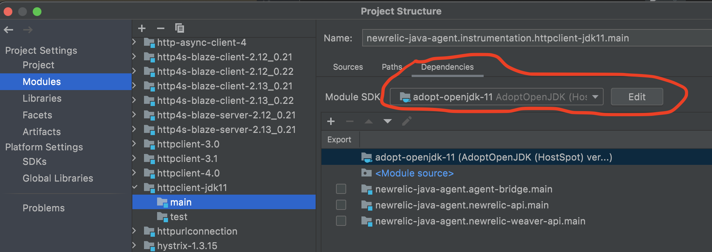

Java 11 HttpClient Instrumentation
=======================

* Add distributed trace headers to the request, so they are propagated to downstream services.
* Generate metrics on external requests made by the HttpClient.
* Process response headers from the request.

## Adding Distributed Trace Headers

The agent instruments the HttpRequest.Builder because it is public api and also convenient to set distributed headers here. 
After the request is built, it is an ImmutableHttpRequest that can be fired off multiple times by a HttpClient. 

## Reporting external requests

The agent instruments the pubic `send` and `sendAsync` methods in HttpClientImpl. 

Instrumenting the public abstract HttpClient was explored. HttpClient is extended by HttpClientFacade and HttpClientImpl in the jdk. 
The facade is a wrapper who delegates all calls to the HttpClientImpl. When instrumenting, this resulted in double reporting
as both classes are instrumented and triggered when sending a request.

## Gotchas

In order to compile this module with Java 11, there are few items to note.

###Intellij 

The build.gradle specifies Java 11 for this module. Unfortunately, Intellij will still default the java version of this 
module to Java 8. You have to change it in Project Structure settings. 



###AIT

A new Java 11 test app was created in the AITs. The pom for the test app uses maven toolchains to determine the path to
Java 11 that would compile the test app. You will get an error unless you have `~/.m2/toolchains.xml`

Here is an example for the `toolchains.xml`

```xml
<?xml version="1.0" encoding="UTF8"?>
<!-- toolchains.xml is used by the pom in the Java11_test_webapp.  -->
<toolchains>
        <toolchain>
        <type>jdk</type>
        <provides>
                <version>11</version>
        </provides>
        <configuration>
                <jdkHome> <!--- /path/to/java11/Contents/Home -----></jdkHome>
        </configuration>
        </toolchain>
</toolchains>
```

###Module-Utils 2.1 

The agent depends on `newrelic-module-util-java` so we can run on Java 9+ environments. Because this instrumentation depends on the 
Java 11 HttpClient, the agent needed to configure `--add-reads java.net.http=ALL-UNNAMED`. [Pull request 13](https://github.com/newrelic/newrelic-module-util-java/pull/13)

`HttpModuleUtil.addReadHttpModule` was added to execute this configuration and is called in the `BootstrapAgent.java`

